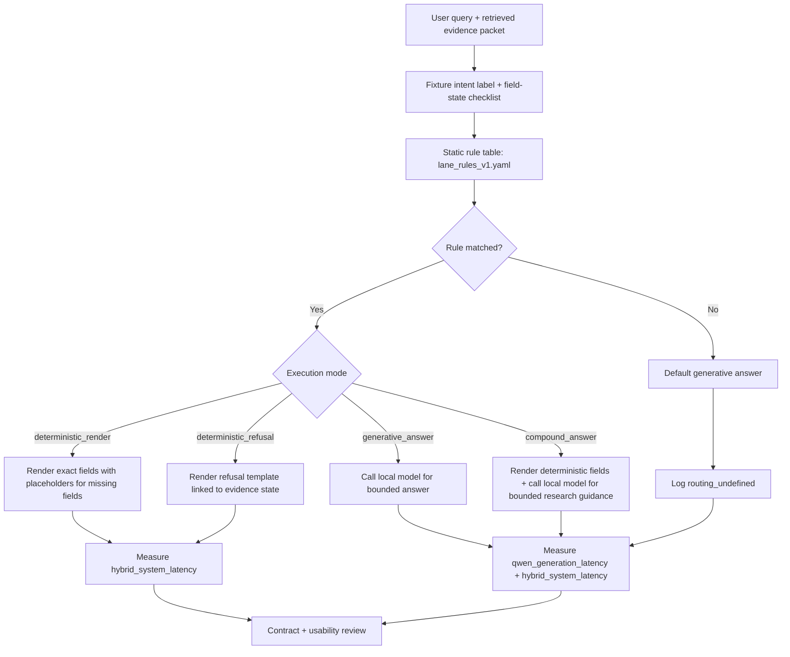

# Lane Decision Flow

Generated: 2026-06-09

This document gives the reviewer-facing flowchart for the first hybrid
answer-lane method.

## Flow

## Interpretive Rule

The flowchart is not a learned router. It is a static experimental policy.
Changing the rule table changes the experimental condition.

## Counterfactual Baseline

An all-deterministic baseline is not the primary comparison because some lanes
require explanatory synthesis, comparison, and research guidance. This boundary
is the point of the paper: deterministic rendering is appropriate for exact
contract-bearing evidence, while generation remains appropriate for synthesis.

The primary baseline is all-generation. The primary hybrid comparisons are:

- hybrid without deterministic refusal;
- full hybrid with deterministic refusal;
- compound answers for mixed-intent rows.
